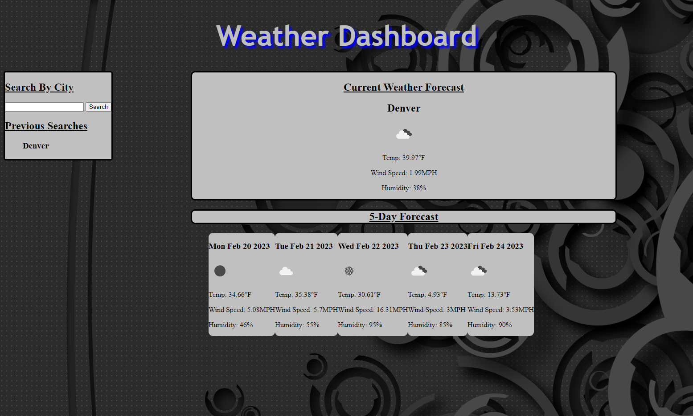

# weather-dashboard

## **Link to deployed application**
https://jjgavery.github.io/weather-dashboard

## **Description**  
In this challenge I was instructed to make a webpage linking an api to display the current weather and a 5 day forecast for a city that is input by a user.

## **Technologies**
- HTML
- CSS
- JAVASCRIPT
- https://openweathermap.org/api
- https://openweathermap.org/api/geocoding-api

## **Preview**
 